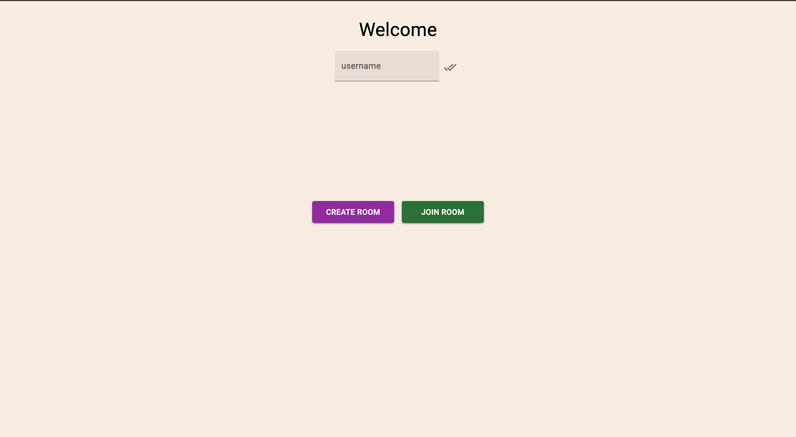
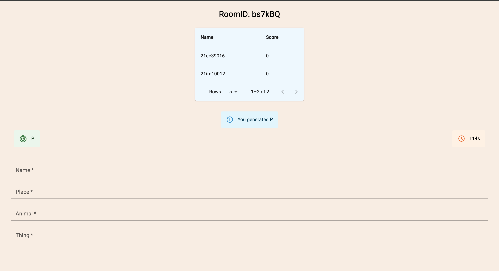
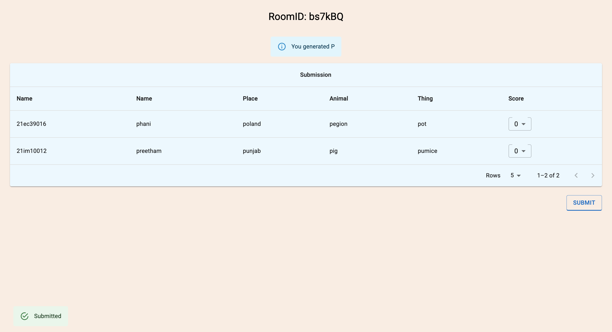

# Name Place Animal Thing: A Real-Time Multiplayer Game

### Screenshots

This project is a real-time multiplayer implementation of the classic "Name, Place, Animal, Thing" game. Built with **Socket.io** and **React**, it enables players to compete online with minimal latency. The backend, running on **Node.js** and deployed on **AWS EC2**, dynamically manages game rooms using temporary, in-memory objects to ensure synchronized state and instant updates across all clients. The system is event-driven, with the server broadcasting actions to every player in a room for a truly unified and shared gameplay experience.

### Features

* **Real-time Communication**: Bidirectional communication ensures that every action, from a player's submission to score calculations, is instantly reflected across all screens.

* **Dynamic Room Management**: Users can join or create new game rooms using a unique RoomID. The backend intelligently tracks each player's state and handles submissions to ensure a smooth game flow.

* **Low-Latency Gameplay**: The game benefits from a high-performance **AWS EC2** environment and uses in-memory objects for real-time state management, guaranteeing minimal delay.

### Tech Stack

* **Frontend**: React, HTML, CSS for a responsive, component-based user interface.

* **Backend**: Node.js and Socket.io for event-driven, real-time communication.

* **Deployment**: AWS EC2 ensures high performance and availability.

* **Data Handling**: In-memory JavaScript objects for fast, real-time state management.

### Platform Navigation

1. **Join or Create:** Open the app and enter a unique RoomID to join an existing game or create a new one.




2. **Submit Responses:** Enter your answers for Name, Place, Animal, and Thing within the designated fields before the timer runs out.



3. **Track Scores:** Watch live score updates and synchronized game state as you compete against other players.



### Installation

#### Frontend

```
cd frontend
npm install
npm start

```

#### Backend

```
cd backend
npm install
node index.js

```
